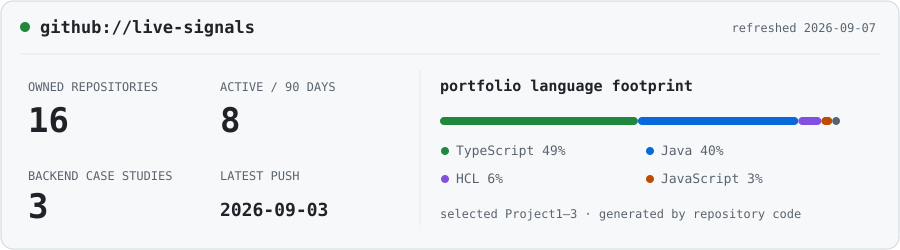

<div align="center">

# Nguyen Viet Dung

`Java Backend Intern` · Ho Chi Minh City, Vietnam

**I build services around the business rules that cannot be allowed to fail.**

[Portfolio](https://viet-dung-portfolio.pages.dev) · [LinkedIn](https://www.linkedin.com/in/nguy%E1%BB%85n-vi%E1%BB%87t-d%C5%A9ng-b4a723355/) · [Email](mailto:vietdungnguyen2005@gmail.com)

</div>



### `vietdung@github:~$ whoami`

```yaml
role: Java Backend Intern
currently:
  - shipping full-stack work at Phu Quoc Times
  - finishing a B.Sc. in Information Security at UIT — VNU-HCM
  - studying failure paths, not just happy paths
defaults:
  language: Java 21
  framework: Spring Boot
  source_of_truth: PostgreSQL
  delivery: Docker + GitHub Actions
```

### `./systems --proof-first`

| Repository | Backend problem | What I can defend |
| --- | --- | --- |
| **[V-Market](https://github.com/vietdungnguyen2005/Project2)** | Modernize Japanese CP932 inventory feeds without interrupting checkout | Transactional inventory, deterministic row locks, restartable Spring Batch, quarantine and reconciliation · [live](https://v-market.vmarket-vietdung2005.workers.dev) · [evidence](https://github.com/vietdungnguyen2005/Project2/blob/main/docs/EVIDENCE.md) |
| **[V-Core](https://github.com/vietdungnguyen2005/Project1)** | Keep a multi-tenant Kanban board correct under contention and retries | WIP invariants, optimistic + pessimistic concurrency, durable idempotency and audit/outbox records · [live](https://v-core-saas.pages.dev) · [evidence](https://github.com/vietdungnguyen2005/Project1/blob/main/docs/evidence/README.md) |
| **[V-Pulse](https://github.com/vietdungnguyen2005/Project3)** | Make slow and uncertain payment work visible and recoverable | Short DB transitions, timeouts, bulkheads, circuit breakers, parking and audited replay · [live](https://v-pulse-payment-ops.vmarket-vietdung2005.workers.dev) · [evidence](https://github.com/vietdungnguyen2005/Project3/blob/main/docs/PAIN_POINT_PROOF.md) |

```text
request
  └─ validate the boundary
      └─ protect the invariant
          └─ persist the decision
              └─ test the failure path
```

### `cat backend-toolkit.txt`

```text
Java 21        Spring Boot      REST APIs         Spring Security
PostgreSQL     Redis            JPA / JDBC        Spring Batch
JUnit 5        Testcontainers   Flyway             Maven
Docker         Git              GitHub Actions     OpenAPI
```

I prefer a modular monolith with explicit transaction boundaries over premature distribution. Redis is an optimization or coordination tool; PostgreSQL remains the correctness authority for inventory, workflow and payment state.

### `watch ./github-signals`



The card above is rendered from the GitHub API by [`scripts/render-profile.mjs`](./scripts/render-profile.mjs). A scheduled [GitHub Actions workflow](./.github/workflows/refresh-profile.yml) refreshes it daily and commits only when the generated assets change.

<details>
<summary><strong>What “production-oriented” means here</strong></summary>

These are personal portfolio systems, not claims of production traffic. I use integration tests with real PostgreSQL/Redis containers to exercise migrations, constraints, transaction behavior and failure recovery. I also document where the current implementation stops—for example, an ambiguous external payment timeout still needs provider-side idempotency and reconciliation before it can claim no duplicate effect.

</details>

### `git log --oneline --human`

- I like requirements that can be expressed as invariants.
- I would rather show the failing interleaving than say “thread-safe”.
- I use AI as an engineering assistant, then review the diff, trace the flow and run the evidence myself.
- I am currently looking for a Java Backend internship where code review and fundamentals matter.

<div align="center">

`open to backend intern opportunities` · [vietdungnguyen2005@gmail.com](mailto:vietdungnguyen2005@gmail.com)

</div>
